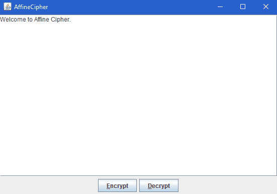

# Affine Cipher

My implementation of Affine Cipher with a simple and easy to use GUI.

- Allows multi-time encryption.
- Uses 3 different key sets for 3 different alphabets

  - Digits
  - Uppercase letters
  - Lowercase letters

- Characters that are not in these 3 alphabets are not encrypted (stays the same).
